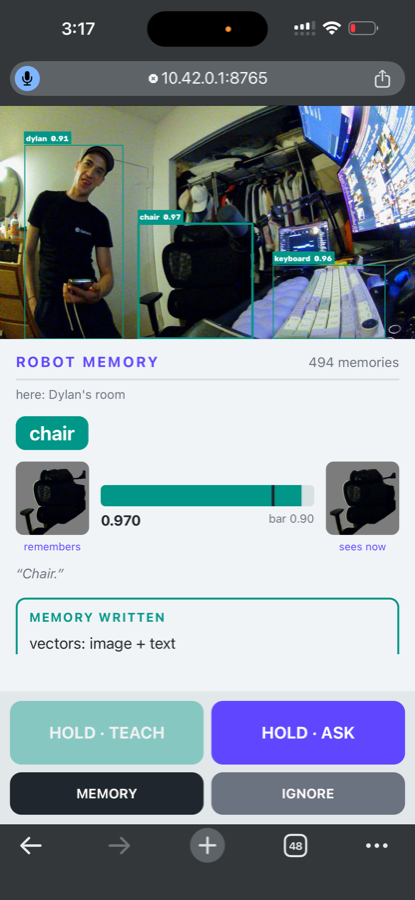
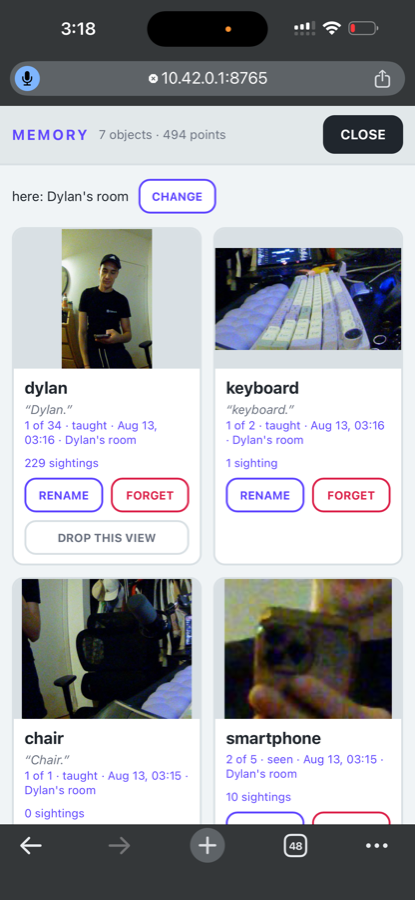
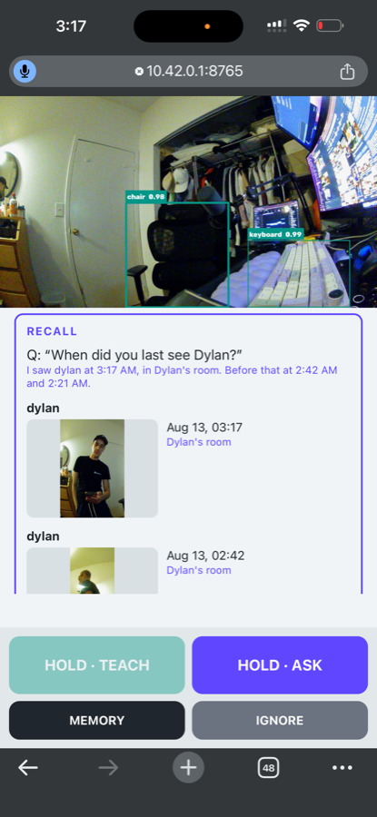

# l6-robot


A robot that **sees an object, learns its name from your voice, and remembers where it saw it**. Everything runs on the Jetson Orin Nano: no cloud, no API key, no LLM. Recognition and recall are vector search over an embedded Qdrant Edge shard.

This is the instructor demo for L6 of [Building On-Device AI Memory with Qdrant Edge](https://github.com/Dylancouzon/SC-Qdrant-C3), a DeepLearning.AI short course from Qdrant.

```text
camera / mic -> detect -> embed -> match -> teach -> recall
```

## What It Does

**Point it at something and hold TEACH.** Say "this is my chair". The robot crops the object from the frame, embeds the crop with CLIP, embeds your sentence with Nomic, and writes one memory with both vectors.

**It recognizes the object from then on.** The panel names what it is looking at, shows the remembered view beside the live one, and compares the score with the recognition bar.



**Everything it knows is browsable.** Each card holds the object's picture, the sentence you taught it with, and how many times it has been seen since. Rename fixes a misheard name without changing the vectors. Forget removes the object.



**Ask where something is.** "When did you last see Dylan?" is matched against the sentence you taught it with. The robot answers with the last few times it saw the object, each with a time, a place, and the photo it took.



**It can be taught from near misses.** An orange `hat? 0.87` box means the nearest taught object came close to the bar without clearing it. Tap the label to confirm it, and the robot learns that angle.

**Power is the off switch.** Every memory is flushed to disk as it is written. Press `R` to close the shard, reload it from disk, and answer again from what is genuinely on the device.

## What It Runs

| Piece | What |
|---|---|
| Vector search | Qdrant Edge 0.7.2, embedded, one shard on disk |
| Vectors | `image` 512-dim CLIP ViT-B/32, `text` 768-dim Nomic v1.5, both through FastEmbed |
| Speech | Whisper-base through `onnx-asr`, on CPU |
| Detection | YOLOE prompt-free, with BoT-SORT tracking |
| Recognition rule | nearest taught view must score at least `RECOGNIZE_THRESHOLD` |

The detector's own class labels are thrown away. Detection finds *a thing*. Memory decides *which* thing, so the robot can learn an object no detector has a word for.

## Run It

```bash
uv sync
cp .env.example .env
uv run python -m robot.app
```

That opens a browser view at `http://127.0.0.1:8765`. YOLO weights download on first run, along with about 1.5 GB of models.

The values in `.env` are tuned for one specific camera. If recognition looks wrong, read [Calibrating For Your Camera](docs/calibration.md) before concluding anything is broken. To drive the robot from a phone, read [the phone demo](docs/phone.md).

## Controls

| Control | Action |
|---|---|
| `T` / hold **TEACH** | Teach the focused unknown object by voice |
| `A` / hold **ASK** | Ask a question by voice |
| `M` / **MEMORY** | Everything it knows, with pictures. Delete, rename, and un-ignore from here |
| `Q` / **IGNORE** | Dismiss the current unknown, and keep it dismissed across restarts |
| `F` | Forget the focused recognized object. Keyboard only |
| `R` | Close the shard and reload it from disk. Keyboard only |
| Ctrl-C | Quit. There is no on-screen quit, so a stray tap cannot end the demo |

**TEACH acts on the most prominent unknown object**, where prominent means large and near the center of the frame. To aim the robot, bring the object closer and hold it toward the middle. Focus is sticky: an object keeps the thick box until something is clearly more prominent, so a button press lands on the object you meant.

Delete from the memory tab, where you can pick an object from a list and see its picture first. Camera-aimed deletion is keyboard-only because focus can move between deciding to press and pressing.

## Teaching It Well

Two habits matter more than any setting.

**Teach each object two or three times, turning it between teaches.** One taught view is one point in CLIP's space, and the same object from another angle can land far from it. Re-teaching adds views. Recognition matches the nearest one. Measured on a live shard: a laptop's best single view covered 103 of its 173 later sightings, and the union of its six views covered all 173.

**Speak a phrase, not a single word.** "This is my laptop" works better than "laptop", because Whisper-base uses surrounding words to understand a short word. The same phrase is also what later questions match against.

Teach objects rather than surfaces. A crop with little in it, such as a blank panel or a reflective surface, can match too much of the room. Fill more of the frame with the object and teach it again.

People are objects too. Point the camera at someone, say "this is Dylan", and they are recognized like anything else. CLIP is not a face recognizer: it keys on the whole silhouette, clothing included, so expect to re-teach when someone changes their jacket.

## Project Layout

The package is split by what you are trying to understand. **`device` imports `brain`, and `brain` never imports `device`**, so the retrieval code can be read without a camera or a socket in the way.

```text
robot/app.py            argparse, main, and headless replay
robot/config.py         per-camera knobs, read from .env
robot/brain/            the retrieval and the decision loop
  core.py               Robot: the loop, attention, teach / forget / ask
  memory.py             Qdrant Edge: the shard, the threshold, recall
  models.py             CLIP, Nomic, and Whisper loaders
  detect.py             YOLOE, tracking, and the stability gate
  labels.py             a spoken sentence to an object's name
robot/device/           camera, browser, microphone, hardware
  live.py               the threads, the buttons, and the voice path
  server.py             HTTP routes, the MJPEG stream, and the certificate
  page.html             the whole user interface
  mic.py                local microphone capture
  draw.py               boxes drawn onto the feed
deploy/                 the setup script and systemd unit for the appliance
testdata/               replay fixtures, and verify_scores.py for calibration
hardware/               the enclosure: print files and the engineering spec
```

Start reading at `robot/brain/core.py`. `process_frame` is the loop, and everything else is a step inside it.

Memories live in `edge-data/`, which is gitignored. Delete that directory for a blank robot, or start with `--reset`.

To run the recognition path with no camera at all:

```bash
uv run python -m robot.app --source testdata/
```

## Documentation

| Page | What is in it |
|---|---|
| [Calibrating For Your Camera](docs/calibration.md) | The recognition threshold, `verify_scores.py`, the `.env` knobs, and every flag |
| [Phone Or Tablet Demo](docs/phone.md) | Running it from a phone, and the certificate |
| [The Headless Appliance](docs/appliance.md) | The demo unit: setup, its own Wi-Fi, maintenance, and the Jetson notes |
| [The Robot Body](docs/hardware.md) | What to buy, how to print it, and how to assemble it |
