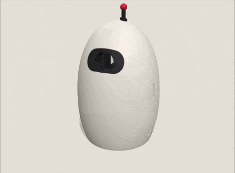
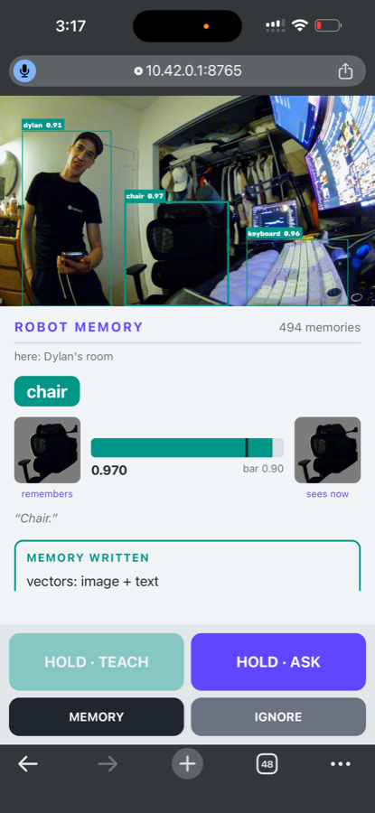
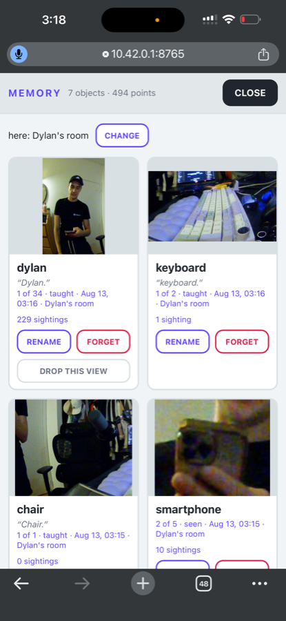
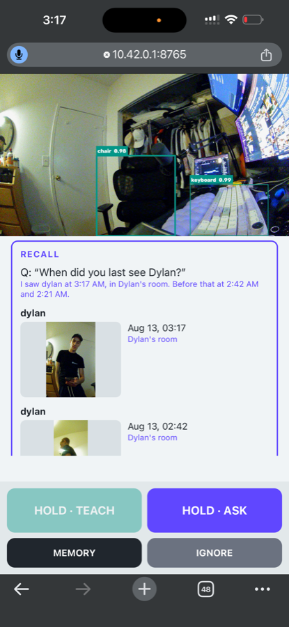

# L6 robot



This robot sees an object, learns its name from your voice, and remembers where it saw it. Everything runs on a Jetson Orin Nano. You do not need a cloud service, API key, or LLM.

It was built for the DeepLearning.AI short course [Building On-Device AI Memory with Qdrant Edge](https://github.com/Dylancouzon/SC-Qdrant-C3).

```text
camera + microphone -> detect -> embed -> search -> remember
```

## What you can do

- Hold **TEACH** and say, "This is my chair." The robot stores the object, its name, and the current place and time.
- Show the object again. The robot recognizes it and displays the remembered view.
- Open **MEMORY** to review, rename, or forget objects.
- Hold **ASK** and ask, "When did you last see my chair?"





## How it works

| Step | Tool |
|---|---|
| Find objects | YOLOE with BoT-SORT tracking |
| Describe images | CLIP image embeddings through FastEmbed |
| Understand speech | Whisper through `onnx-asr` |
| Describe questions | Nomic text embeddings through FastEmbed |
| Store and search memories | Qdrant Edge |

The detector finds objects but does not name them. Names come from the memories you teach the robot.

## Run it

You need Python 3.12 or newer and [uv](https://docs.astral.sh/uv/).

```bash
uv sync
cp .env.example .env
uv run python -m robot.app
```

Open `http://127.0.0.1:8765`. The first run downloads about 1.5 GB of model files.

If recognition is unreliable, follow [Calibrate the Camera](docs/calibration.md). To use a phone, follow [Use a Phone](docs/phone.md).

## Controls

| Control | Action |
|---|---|
| `T` or **TEACH** | Teach the focused unknown object |
| `A` or **ASK** | Ask where an object was seen |
| `M` or **MEMORY** | Review and edit saved objects |
| `Q` or **IGNORE** | Hide the focused unknown object |
| `F` | Forget the focused recognized object |
| `R` | Reload memories from disk |
| Ctrl-C | Stop the app |

The focused object has the thickest box. Move the object close to the center of the frame before teaching it.

## Teaching objects

- Teach each object two or three times from different angles.
- Speak a short phrase such as "This is my laptop," not a single word.
- Fill the frame with the object. Avoid teaching blank or reflective surfaces.
- Teach a person again if their clothing changes. This project recognizes the whole image, not a face alone.

## Project guide

```text
robot/brain/       detection, embeddings, memory, and recall
robot/device/      camera, microphone, web server, and interface
robot/app.py       command-line entry point and image replay
robot/config.py    settings loaded from .env
deploy/            headless Jetson setup
hardware/          printable enclosure files
testdata/          sample images and calibration check
```

Start with `robot/brain/core.py`. Its `process_frame` method connects the main steps.

To run the recognition path with the sample images instead of a camera:

```bash
uv run python -m robot.app --source testdata/
```

Memories are stored in `edge-data/`, which Git ignores. Use `--reset` to start with an empty memory.

## Build guides

- [Build the Robot Body](docs/build.md)
- [Calibrate the Camera](docs/calibration.md)
- [Use a Phone](docs/phone.md)
- [Set Up a Headless Jetson](docs/appliance.md)
