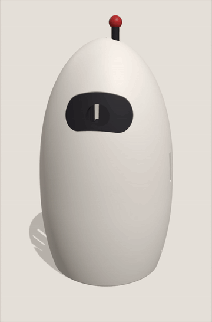

# Print and build the shell

Six printed parts, no screws. Budget about a day and a half of printing.

## 1. The print files

They are already in this folder. Three plates, one per filament colour:

| File | Colour | Parts on it |
|---|---|---|
| `l6b1_white_plate.3mf` | white | shell |
| `l6b1_charcoal_plate.3mf` | charcoal | keel, camera clamp, eye visor, antenna |
| `l6b1_red_plate.3mf` | red | antenna tip |

Each plate is already laid out, and the biggest is 177 x 176 mm, so it fits any common bed. Open it in your slicer and print. These are plain 3MF files with no printer-specific settings in them, so PrusaSlicer, Orca and Cura read them as happily as Bambu Studio does.

The six `l6b1_*.stl` files are the same six parts, one per file. Use those if something in your toolchain won't take a 3MF: a repair tool, an older program, or an online print service.

To change the model, open `l6-bot-v54.html` in Chrome. It builds the shape in the browser, which takes about 45 seconds, and the tab looks frozen while it works. Then use the export buttons to write new plates. There is an audit box in the corner that re-checks the model every time the page loads; if it reports a failure, don't print.

## 2. Measure before you print

Get out the calipers and check three things.

- **Jetson height**, nominal 103 mm. If yours is different, change `KIT_LIFT` near the top of the HTML and export again. This is what makes the Jetson a tight fit instead of a rattle.
- **Camera board**: 37 x 37 mm, 1.4 to 1.8 mm thick, connectors on the back face.
- **Lens barrel, racked all the way in**: 27 mm at most from the front of the board, and nothing around it wider than 26.5 mm across.

Get a camera number wrong and the board will not go in. There is no second chance, because the visor is glued.

## 3. Printer settings

Bambu P1S (256 mm bed) or anything similar. PLA, 0.4 mm nozzle, 0.2 mm layers, 3 walls, 15% infill. **Use the same profile for every part**, with no per-part overrides.

- **Supports: one patch only**, under the keel's camera head, about 108 mm up. Turn on a dense support interface. It holds up a thin 40 mm pillar beside the camera window; if that patch comes loose, the roof of the window loses its anchor.
- **Brim** on the shell, keel, visor and antenna.
- The keel is the big one: 160 mm tall, about 103 cm3. A failed print costs most of a day, so watch the first layers.
- Look at the slicer preview of the keel's camera window. Its roof is a 32 mm bridge tilted 8.6 degrees, and slicers often read that as an overhang and let it sag. Sagging there eats the clearance over a connector.

## 4. Assemble

The order matters. Don't skip ahead.

1. **Jetson into the keel**, on edge, ports toward the back, power end down. Put one end in first and swing the other one down; it will not go in flat. Press it home onto the four small pads. Leave the power plug off for now.
2. **Camera board in from the front**, along the lens axis, never from above. Feed both cables back through the window in the camera head first, then slide the board straight back until it stops against the frame behind it.
3. **Clamp on**: lens through the open side, arms down the two channels, push until both clips click.
4. **Rack the focus all the way in.**
5. **Lift the whole assembly up through the hole in the bottom of the shell**, then twist 18 degrees to lock. There is a little free play past the lock, so twist to the mark rather than until it stops.
6. **Plug in the power barrel**, reaching in through the bottom hole, and lead the cable out of the slot at the back so it turns down onto the desk.
7. **Set the focus** through the bottom hole.
8. **Glue the eye visor in last**, pressed straight in. One drop. This step is permanent.
9. **Antenna into the hole on top**, quarter turn.

Zip tie the camera cable to the keel wherever it wants to bunch up.

## 5. Taking it apart again

The camera board comes out: pry the clamp up at the notch in the middle until the clips let go, then slide the board straight out the front. The Jetson lifts out after that.

The visor does not come out without breaking it. Everything above the camera is a one-way trip.

## Reference

[SPEC.md](SPEC.md) is the full engineering spec: every dimension, tolerance and past mistake. Read it before changing the model, not before printing it.
